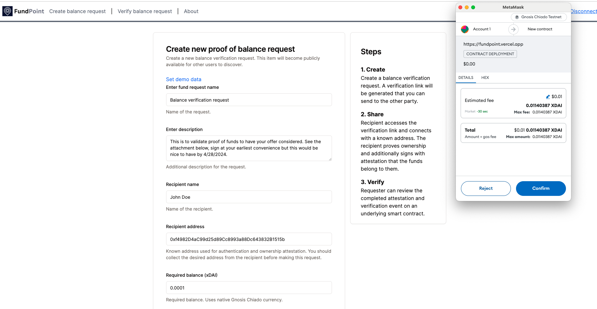
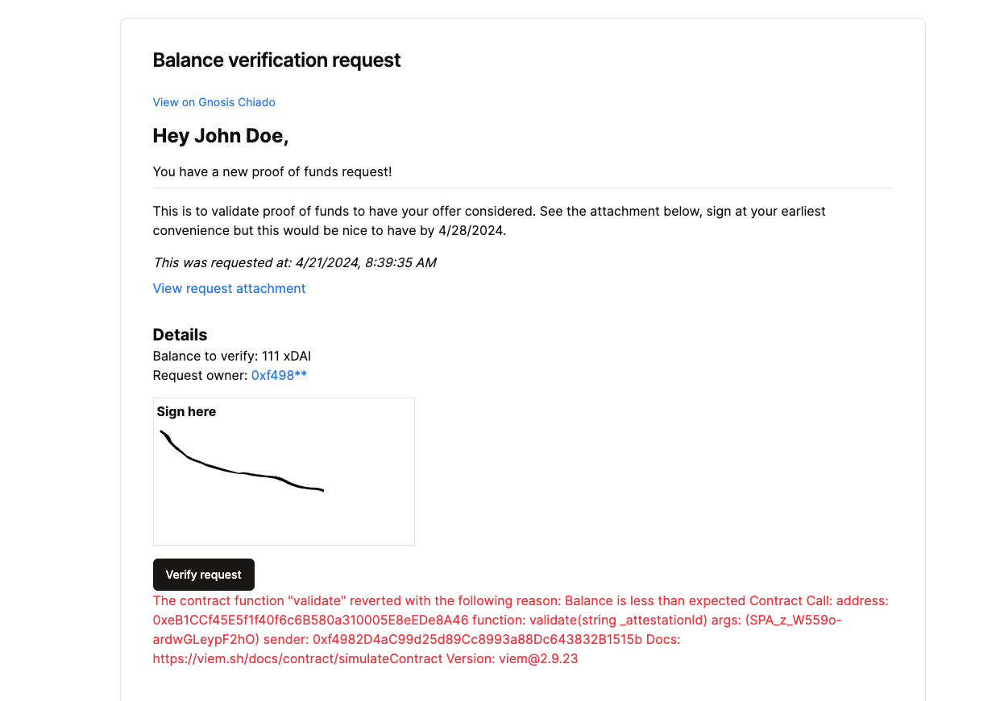
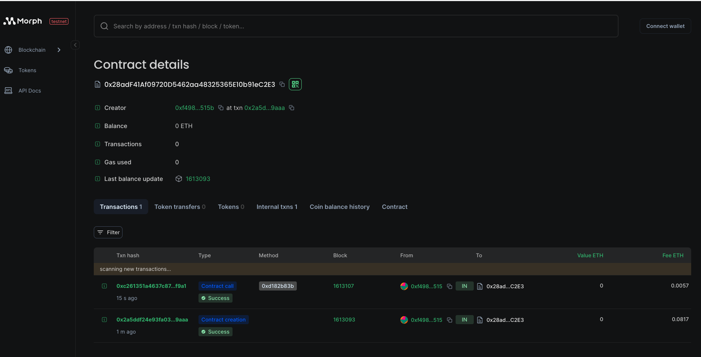

    

## FundPoint

Mediated proof of fund requests managed by smart contracts with attestations of record backed by Sign Protocol.

Built for <a href="https://ethglobal.com/events/scaling2024">Scaling Ethereum 2024</a>.

Live Demo url: https://fundpoint.vercel.app (supports Arbitrum Stylus, Gnossis Chiaddo, Morph (testnet))

Demo video: https://youtu.be/fupCAWnYOF8

### Inspiration

Many high value purchases warrant proof of funds requests to know if a given offer or potential buyer is serious.

With Fundpoint, you can prove or assert you have a certain balance on connected wallets without exposing bank statements or keys to the requester. Fundpoint generates a proof point at the time of attestation / verification that can be shared with the requester with a signature saved via Sign Protocol.

Example of this process in real estate: <a href="https://www.investopedia.com/ask/answers/082316/how-do-mortgage-lenders-check-and-verify-bank-statements.asp#:~:text=A%20proof%20of%20deposit%20is,closing%20costs%20for%20a%20property." target="_blank"> Proof of funds</a>

### How it works

* **Buyers:**
    * Securely connect their wallets, showing ownership over particular accounts.
    * Generate smart contract transactions and sign protocol attestations demonstrating sufficient funds for a specific transaction, without revealing additional or personal details.
    * Share these proofs with sellers or realtors for verification.
* **Sellers and Realtors:**
    * Verify proofs using the app to confirm a buyer's financial eligibility for a smooth pre-qualification process.
    * Expedite serious offers by eliminating the need for lengthy document verification.

When a balance request is created, a smart contract gets deployed marking the information around the balance request. The address of the smart contract serves as part of a unique url which can be shared with the recipient or verifier - only the intended recipient can validate their balance and create an attestation to be shared with the seller.

When the verification is complete, a blockchain event is also emitted with information about the validation. This event can be listened to on other networks or blockchain platforms (or for indexing on `the Graph` as well).

### Technologies used

**Sign Protocol**: Utilized for generating and verifying signatures to ensure the authenticity and integrity of attestations without revealing sensitive information. When balance verifications are completed, a hosted attestation is created alongside the verification process. Several different APIs were used. From the about page, a schema ID can be created; every verification gets a new schema emitted in the form of an attestation. Completed attestations can be reviewed by the owner and the recipient after the fund verification is completed on the sign protocol explorer.

<a href="https://scan.sign.global/attestation/SPA_rJCPlP1-ZaL_LirRGFlb8" target="_blank">Example attestation for a proof of funds request</a>

The attestation is created at time of fund verification and contains a hash of the user's signature. Every fund verification requires a successful attestation be created and this is currently created via the off chain sdk (Airweave).

**Filecoin**: Used for secure file storage for additional material related to the fund request. When the other party visits the authenticated balance verification link, he or she can access the uploaded material related to the purpose of the upload. This is also secured with saturn and uses lighthouse web3 sdk underneath for both upload and download based on the cid. Created cids are saved to the smart contracts and are retrieved when the verification page is accessed. The cid is only revealed to the authorized parties (owner and recipient) for each smart contract / transaction.

<a href="https://gateway.lighthouse.storage/ipfs/QmeSUzMZSmUnj56WkriWwHjWqtJyarFX41EkPdscrQusuy">Example uploaded document</a>

***Blockchains***

FundPoint was tested on a few different blockchains with deployed contracts that support fund verification in each native currency. Depending on the use case, the event fired from the contract when verification is completed can be used to trigger separate blockchain-specific workflows.

**Arbitrum**: Transactions on Arbitrum are confirmed significantly faster than on the Ethereum mainnet, typically within seconds. This is crucial for a fund verification app, where users on a stylus device would expect quick results without long wait times. Low fees also enable creating multiple requests for near zero cost, combined with being fully self-managing, can be a significant time and cost savings compared to human involvement for back and forth exchanges for doing fund verification/ownership.

Example deployed and verified fund smart contract on Arbitrum Stylus: https://stylus-testnet-explorer.arbitrum.io/address/0x9189c7722C0B815cd3752d559aD10980E20e59B4/transactions#address-tabs.

**Gnosis**: Gnosis Chain, like Arbitrum, offers lower transaction fees (gas) compared to the Ethereum mainnet.  Gnosis Chain offers optional privacy features through zk-SNARKs (Zero-Knowledge Succinct Non-interactive Argument of Knowledge). This allows for certain transactions to be verified on the blockchain without revealing all the details, potentially enhancing privacy for some fund verification processes. Additional permission control features could also be leveraged for contract access and verification. Gnosis was easy to get up and running and able to both query smart contracts as well as fetch them to support unlimited peer to peer fund verification requests.

Example deployed and verified fund smart contract on Chiado: https://gnosis-chiado.blockscout.com/address/0xc7f359Ff414fb601b7fAF9D1EdB2742692ABe85C.

**Morph**: Employed for interoperability and cross-chain transactions, enabling seamless connectivity between different blockchain networks to enhance the accessibility and usability of Fundpoint across diverse ecosystems. It was easy to adjust the platform to support the Morph network and the settlement times on the deployed smart contract on Morph were great (almost instant). Making tracking real time updates to the contract possible.

Example deployed and verified fund smart contract on Morph testnet: https://explorer-testnet.morphl2.io/address/0x28adF41Af09720D5462aa48325365E10b91eC2E3

Eth Mainnet is also supported though carries additional/higher fees. On the above fund verification explorer contracts, the first transaction represents the fund contract creation by the owner. The second transaction indicates a successful verification (done by a different address if specified). An emit is evented from the blockchain as well, `FundVerified` which contains the balance and signature attestation id.

### How to run

1. Fill in values in `.env.sample`, copy to a new file `.env`.

2. `yarn; yarn dev`

The app should now be running on port 3000.

### Updating the smart contract

1. Update `FundContract.sol` in `/fundcontract/contracts`

2. Install dependencies via yarn in root folder. Run `npx hardhat compile` from `/fundcontract`

3. Copy contents (includes ABI) to `metadata.tsx#FUND_CONTRACT`

4. Rebuild web project

### Challenges we ran into
Integration Complexity was the most challenging: Overcoming the technical challenges of integrating multiple blockchain protocols and APIs seamlessly into FundPoint's app flows required additional testing and debugging.

### Accomplishments that we're proud of
* User-Centric Design: Designing FundPoint with a focus on user experience and security has resulted in a platform that offers seamless and secure fund verification processes, enhancing trust and confidence among buyers, sellers, and realtors.
* Blockchain Interoperability: Achieving interoperability between different blockchain networks and protocols showcases our commitment to fostering a connected and accessible decentralized ecosystem.

### What's next for FundPoint

1. Enhanced Smart Contract Functionality: Implementing advanced smart contract functionalities to automate and streamline fund verification processes further, reducing manual intervention and increasing efficiency.

2. Expanded Blockchain Support: Adding support for additional blockchain networks and protocols to broaden FundPoint's reach and accessibility, catering to users across different blockchain ecosystems.

3. Integration of Advanced Security Features: Integrating advanced security features such as zero-knowledge proofs and multi-factor authentication to enhance the security posture of FundPoint and protect user data and funds effectively.

### Useful links

* https://ethglobal.com/events/scaling2024/home
* https://ethglobal.com/events/scaling2024/prizes
* https://docs.arbitrum.io/stylus/stylus-quickstart
* https://docs.sign.global/developer-apis/index-1/npm-sdk
* https://docs.morphl2.io/docs/build-on-morph/intro
* https://github.com/boidushya/web3modal-gnosis/blob/master/configs/index.tsx
* https://docs.lighthouse.storage/lighthouse-1
* https://docs.saturn.tech/

# Image gallery

## Home

## About page / creating a new Schema ID for attestation

## Creating a new fund request

## Request created

## Verifying a fund request

## Insufficient balance error

## Example Filecoin IPFS Upload

### Example Morph contract

### Example Arbitrum Stylus contract

### Example Gnosis contract

## Verified

## Attestation

## Smart Contract code sample

<!--
FundPoint
Demo:
* If you've ever bought a hom
* Intro of proof of funds
* Talk about integrating sponsors
* Increase accessibility. Speed up the process and eliminate the human back and forth for authentication.
* Proof of record stored transparently.
Creation
* Every request gets it's own smart contract
* Filecoin manages data hosting for attachments. This could include things like the bank letter or similar to still include to the signer.
* Enter how much funds you want the individual to prove.
Deploy
* Describe what is happening
* Link you could share via email. Say to complete at convenience.
Sign
* Authentication
* Completely managed by the previous smart contract
* Describe different benefits of using contract record
* Show blockchain smart contract record
* Sign protocol emit with a hash of the signature.
* Need to demonstrate sufficient balance.
* Event is emitted on sign, can be tracked or monitored externally
Github
Code is open source
Prototype is live.
 -->
